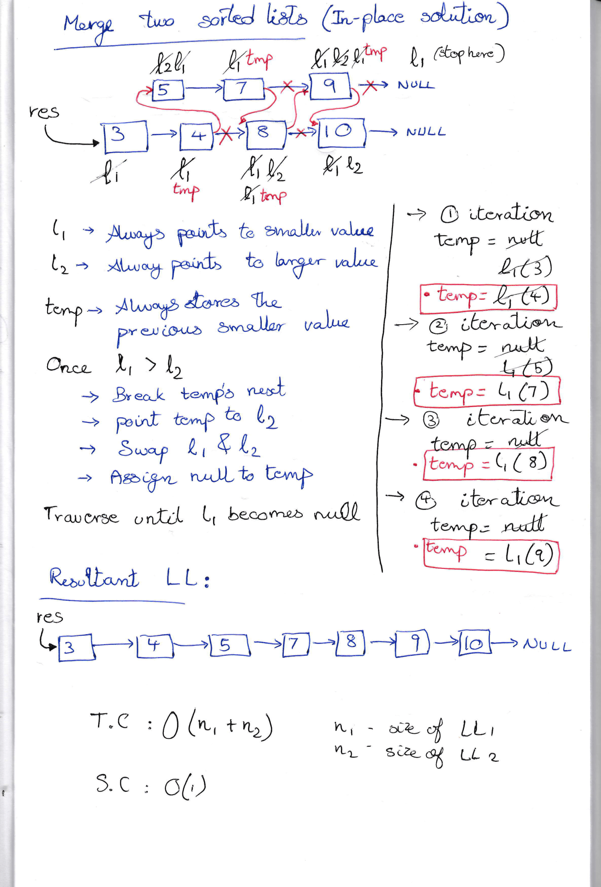
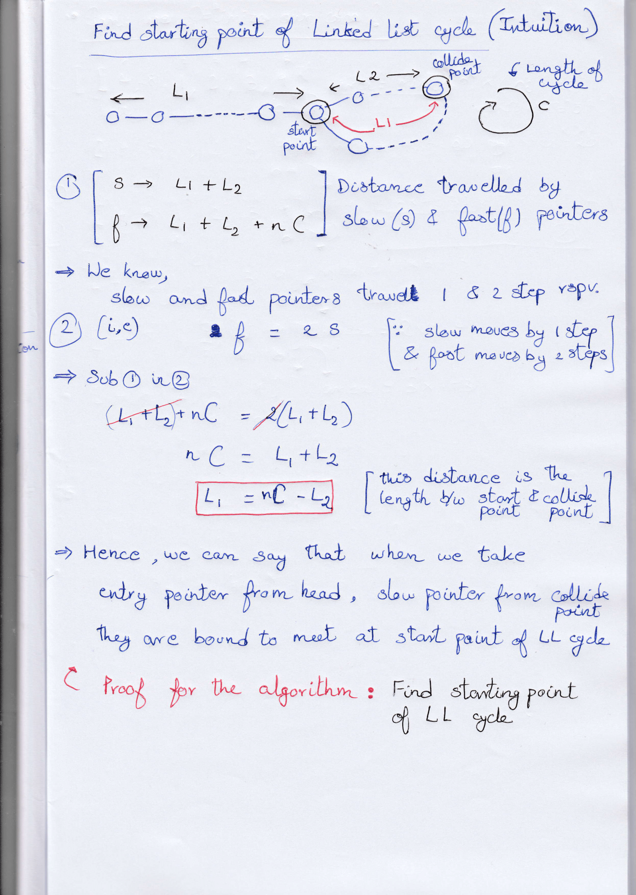

# SDE Sheet : Linked lists

## Task list

### Day 5

| Completion Status | Linked List Problem | Explanation | Solution |
| --- | --- | --- | --- |
| ✅ | [Reverse Linked List](https://leetcode.com/problems/reverse-linked-list/) | [Iterative Approach](#reverse-a-linkedlist) | [Java Soultion](./ReverseLL.java) |
| ✅ | [Middle of the Linked List](https://leetcode.com/problems/middle-of-the-linked-list/) | [Brute - Optimal Approach](#find-the-middle-of-linkedList-amazon-microsoft) | [Java Soultion](./MiddleOfLL.java) |
| ✅ | [Merge Two Sorted Lists](https://leetcode.com/problems/merge-two-sorted-lists/) | [Brute force Approach](#merge-two-sorted-linked-list) | [Java Soultion](./MergeTwoSortedLists.java) |
| ✅ | [Remove Nth Node From End of List](https://leetcode.com/problems/remove-nth-node-from-end-of-list/submissions/) | [Iterative Approach]() | [Java Soultion](./RemoveNthNodeFromEndofList.java)
| ✅ | [Delete Node in a Linked List](https://leetcode.com/problems/delete-node-in-a-linked-list/) | [Iterative Approach]() | [Java Soultion](./DeleteNodeinaLinkedList.java) |
| ✅ | [Add Two Numbers](https://leetcode.com/problems/add-two-numbers/) | [Iterative Approach]() | [Java Soultion](./AddTwoNumbers.java) |

---

### Day 6

| Completion Status | Linked List Problem | Explanation | Solution |
| --- | --- | --- | --- |
| ✅ | [Intersection of Two Linked Lists](https://leetcode.com/problems/intersection-of-two-linked-lists/) | [Brute - Better - Optimal I & II Approach](#intersection-of-two-linked-lists) | [Java Soultion](./InterectionOfTwoLL.java) |
| ✅ | [Linked List Cycle](https://leetcode.com/problems/linked-list-cycle/) | [Brute & Optimal Approach](#linked-list-cycle) | [Java Soultion](./LinkedListCycle.java) |
| ✅ | [Reverse Nodes in k-Group](https://leetcode.com/problems/reverse-nodes-in-k-group/) | [Optimal Approach](#reverse-nodes-in-k-group) | [Java Soultion](./ReverseKGroup.java) |
| ✅ | [Palindrome Linked List](https://leetcode.com/problems/palindrome-linked-list/) | [Iterative Approach]() | [Java Soultion](./PalindromeLL.java) |
| ✅ | [Linked List Cycle II](https://leetcode.com/problems/linked-list-cycle-ii/) | [Brute & Optimal Approach](#find-the-starting-point-of-the-cycle) | [Java Soultion](./FindStartingPointInLLloop.java) |
| ✅ | [Flattening a Linked List](https://practice.geeksforgeeks.org/problems/flattening-a-linked-list/1#) | [Iterative Approach]() | [Java Soultion]() |
| ✅ | [Rotate List](https://leetcode.com/problems/rotate-list/) | [Iterative Approach]() | [Java Soultion]() |

---

## Linked List Problems Rundown 
### (Approaches to Solve)

### Reverse a LinkedList 

- Create a dummy node - **newHead** and point it to null.
- Run a loop until the head of LL reaches null.
	- For each iteration, create a node **next** which stores the next reference of head.
	- Break the next reference of the head by pointing it towards the **newHead**.
	- Reassign **newHead** with head and then head with node **next**.
- Return the **newHead**
- Time Complexity: O(N) | Space Complexity: O(1)

---

### Find the middle of LinkedList 
#### `Amazon | Microsoft`

#### Brute-force
- Count all nodes in the given Linked list in one iteration
- Now, calculate mid as the count by two and add one only if the size is even
- Traverse again to reach the mid and return the mid node
- Time Complexity: O(N) + O(N/2) | Space Complexity: O(1) 

#### Optimal: Runner Technique 
- Take two nodes slow and fast and point them to the head node.
- Move the slow node by a distance of one and the fast node by a distance of two.
- When the fast node completes the traversal, the slow node has reached the middle.
- Return the slow node.
- Time Complexity: O(N/2) | Space Complexity: O(1)

---

### Merge two sorted Linked List 
#### `Yahoo | Amazon`

#### Brute-force 
#### Create new LL

- Take the head nodes of the given two linked lists as h1 and h2
- Create a dummy node d initialized to null
- Compare the node values of h1 and h2 and take the smaller one
- Create a new linked list and insert the smaller value into the LL.
- Now, point next of the dummy node to the LL, and create another duplicate dummy node dd to create new nodes
- If both of the heads h1 and h2 reach null, point the dd node to null as well.
- Repeat the comparisons and return dummy node d as the new head of LL.
- Time Complexity: O(n1 + n2) | Space Complexity: O(n1 + n2) 

#### Optimal approach
#### In-place splicing of LLs

- Take two dummy nodes l1 and l2 pointing to larger and smaller LLs respectively
- Point l1 to whichever node value is smaller among given LLs and point l2 to larger node value
- Take another dummy node res which points to l1. This res is the resultant answer by the end of function execution
- Take a dummy node temp to store the smaller value among LL ( Basically to remember the last smallest node )
- Traverse through the LLs until:
	- l1 is smaller than l2
	- Reassign the value to temp
	- When l1 becomes greater than l2:
		- Break the next of temp
		- Point the next of temp to l2
		- Swap l1 and l2 ( Because l1 got bigger than l2)
		- Change temp to null
	- Repeat this iteration until l1 becomes null
- Time Complexity: O(n1 + n2) | Space Complexity: O(1)

	

---

### Intersection of Two Linked Lists 
#### `Amazon | Microsoft`

#### Brute Force approach

- Check for every node in second LL to check each node in first LL for equality
- When you found equal nodes return it, else you will reach the end hence return null
- Time Complexity: O(m * n); where m and n are length of LL 1 & 2 respectively

#### Better approach 
#### Hashing

- Traverse through first LL and hash the **Node Address**
- Again traverse for second LL and check for equality
- When you found equal node address from HashMap return it, else you will reach the end hence return null
- Time Complexity: O(m + n); where m and n are length of LL 1 & 2 respectively
- Space Complexity: O(m); where m and n are length of LL 1 & 2 respectively

#### Optimal approach I - ( Lengthier approach )

- Take dummy nodes at head of both LL, and keep a count to store length of both the LL
- Take dummy nodes at head of both LL again, and cover the difference one LL using lengths
- Then, traverse simultaneously both the nodes to reach an intersection point
- When you found equal nodes return it, else you will reach the end hence return null
- Time Complexity = O(m) <= O(2m) <= { O(m) + O(m-n) + O(n) }; where m is length of longer LL and n is length of shorter LL

#### Optimal approach II - ( Concise approach )

- Take two dummy nodes d1 and d2, assign them to head of the LL
- Move d1 and d2 simultaneously till one of them reaches null
- Now, reassign that dummy node that is at null to the head of the other LL
- Repeat the same process for both nodes until them meet at intersection
- When you found equal nodes return it, else you will reach the end hence return null

#### Intuition behind Optimal approach II

- The first iteration is to find the difference directly and reassigning them to equate the difference
- Hence in the second iteration they either meet at intersection if exists or null
- This approach is similar Optimal approach I, but instead of calculating difference, here we directly find it with our logic
- Time Complexity: O(2m); where m is the length of longer LL

---

### Linked List Cycle 
#### `Amazon | Samsung | Microsoft`

#### Brute force approach 
#### Hashing

- Take a dummy node d and traverse through the Linked List
- Create a HashMap to store Nodes and check whether the nodes exist already
- Hash the node itself if it's not present in the HashMap
- Return the point where the node exists or when we reach null
- Time Complexity: O(N) | Space Complexity: O(N)

#### Optimal 
#### Runner Technique

- Take two pointers slow and fast
- Traverse slow pointer by one step and fast pointer by two steps
- If cycle exists, we can be pretty sure slow and fast pointer meet again
- If not then return null
- Time Complexity: O(N) | Space Complexity: O(1)

#### Intuition for Runner Technique

- As the fast pointer moves by two steps, ultimately it will meet at any one point

---

### Reverse Nodes in k-Group 
#### `Hard Problem from LeetCode`

- Take four dummy nodes
- One to point to the new head of LL
- Other three to keep track of previous node, current node and the next node
- Apply reversing LL technique for k groups and keep on updating the dummy nodes
- Return the new head
- Time Complexity: O(N) | Space Complexity: O(1)

---

### Find the starting point of the cycle

#### Brute force approach 
#### Hashing

- Hash all the nodes in a HashMap
- When the same node occurs twice return it, else return null
- Time Complexity: O(N) | Space Complexity: O(N)

#### Optimal approach 
#### Runner Technique

- 1. Find the collision point
- Move slow pointer by 1 step and fast pointer by 2 steps
- They are bound to collide at one node if there exists a cycle
- 2. Find the Starting point of LL Cycle
- Take entry pointer from head of LL 
- Move both **entry** and **slow** pointers by 1 step
- When entry and slow pointers collide, that's the starting point of the LL
- Hence return that node 
- If no cycle exists, fast will reach null, hence return it
- Time Complexity: O(N) | Space Complexity: O(1)

#### Intuition behind this algorithm

	

---

### Flattening a Linked List

#### Amazon, Flipkart, Goldman Sachs, Microsoft, Paytm, Qualcomm, Snapdeal, Visa

#### Optimal Approach
#### Recursive approach + Merge Two Sorted LL 

- The problem states that we are given a LL with two pointers - next and bottom
- We have to flatten given LL in such a way that the first node must contain all other nodes connected using bottom pointer in a sorted order
- So, if we can try to sort each LL from the back, we can reach to the solution
- We can sort two linked lists recursively using Merge Two Sorted LL logic
- Time Complexity: O(N) | Space Complexity: O(1)

---

#### Rotate List

#### Adobe, Amazon, Microsoft, Goldman Sachs, MMT

#### Brute force approach

- Rotate the LL by indivdually adding nodes from the end
- Time Complexity: O(k * N) | Space Complexity: O(1)

#### Optimal approach

- Count the length of Linked list
- Correct the value of k
- Point last node to first node, once you are done with first step itself
- Traverse for `len-k` times, and save the next node in temp
- Then break the next's link and reassign it to null
- Return the temp
- Time Complexity: O(N) | Space Complexity: O(1)

---

### Clone a Linked List with next and random pointer

#### Brute force approach 
#### Hashing

- Hash the current node with new duplicate node for the first traversal
- Assign next and random pointers, one by one, using Hashmap for the next traversal
- Return the new clone (deep copy) of LL

#### Optimal appraoch

- Copy nodes and insert them right after the original nodes
- In the next iteration, Assign random pointers for the copy nodes using a dummy node `iter` and original nodes
- Restore the original list, and extract the copy list

---
